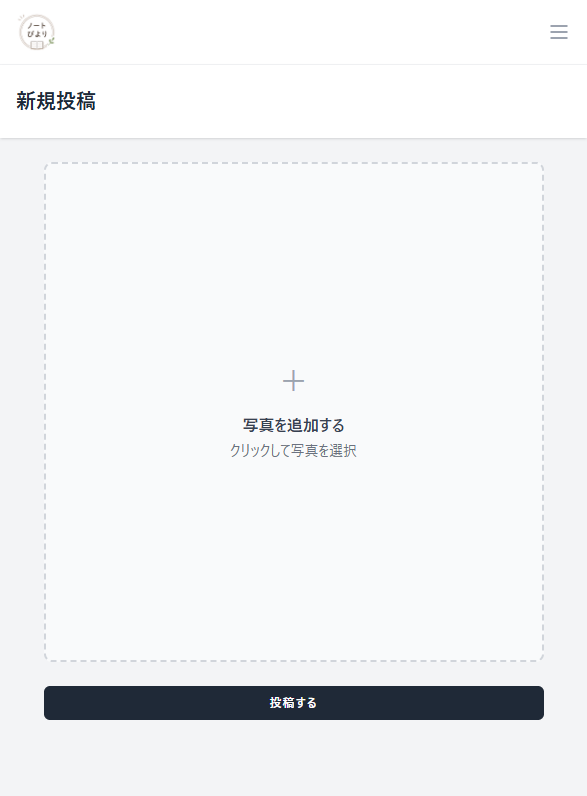

# ノートびより 📓✨

> 愛用しているノートや手帳のオリジナルレイアウトを共有し、新しいアイデアに出会えるレイアウト特化型Webサービス

---

## 📖 サービス概要

ユーザーがお気に入りのノートや手帳のレイアウト・書き方の工夫を写真とともに共有し、自分に合った書き方のアイデアを探すことができるWebサービスです。

### 開発の目的
実務を意識したWebアプリケーション開発の実践、およびAWSクラウドインフラへの本番デプロイ・運用を見据えたポートフォリオとして開発を行っています。

---

## 🛠 使用技術スタック

### Backend
- **PHP** 8.5
- **Laravel** 12
- **Laravel Breeze** (認証基盤)

### Frontend
- **Vue 3**
- **TypeScript**
- **Inertia.js**
- **Vite**
- **Tailwind CSS**

### Database
- **MySQL** 8.4

### Development & Tools
- **Docker / Docker Compose**
- **Nginx** / **PHP-FPM**
- **Mailpit** (ローカルメールテスト)

### Infrastructure (予定)
- **AWS**
  - EC2 (アプリケーションサーバー)
  - RDS (MySQL)
  - S3 (画像ストレージ)
  - CloudFront (CDN配信)

---

## 🎯 主な機能

### 未認証（ゲスト）
- [x] ユーザー新規登録（メール認証機能付き）
- [x] ログイン / ログアウト

### 認証済み（ユーザー）
- [x] ダッシュボード
- [x] マイページ機能
  - プロフィール情報更新
  - パスワード変更
  - アカウント削除
- [x] 新規投稿機能
  - 画像の選択 & リアルタイムプレビュー
  - フォーマット対応 (JPEG / PNG / WebP)
  - クライアント・サーバー両面での画像サイズバリデーション
  - 画像ファイルのストレージ保存

---

## 🖥 画面イメージ

### ログイン画面


### 新規投稿画面


## ⚙️ 開発・パフォーマンス検証（大量テストデータの生成）

本番運用を想定し、投稿一覧などの表示検証やパフォーマンス測定を行うため、Seeder・Factoryを活用して**合計2,000件のダミーデータ**を自動生成する仕組みを構築しています。

### テストデータの仕様
- **テストユーザー**: 100名
- **ユーザーあたりの投稿数**: 20件
- **投稿総数**: 2,000件 (画像: 2,000ファイル)
- **画像ストレージ構成**:
  投稿ごとに一意のファイル名を割り振り、DBレコード (`post_images.image_path`) と実ファイルが1対1で対応するように生成。

```text
storage/app/public/posts/
├── test_post_0001.jpg
├── test_post_0002.jpg
├── test_post_0003.jpg
├── ...
└── test_post_2000.jpg
```

### 生成の流れ (Factory & Seeder)
1. **元画像の準備**: テストベースとなる画像を1枚配置
2. **Factoryの定義**: `UserFactory`, `PostFactory`, `PostImageFactory` にて生成ルールを策定
3. **Seederによる一括生成**:
   - 100名のユーザー作成
   - ユーザーごとに20件の投稿を紐付け
   - 画像ファイルを複製・リネームしてStorageに配置し、パスをDBに保存

### テストデータ投入コマンド

```bash
# Seederの実行
docker compose exec laravel.test php artisan db:seed

# DBとテスト環境を完全リセットして再投入する場合
docker compose exec laravel.test php artisan migrate:fresh --seed
```
※ `migrate:fresh` 実行時は、Storage内の既存テスト画像ファイルのクリーンアップも合わせて実施します。

### 検証項目
大量データ投入環境を利用し、以下の観点で設計・動作確認を行っています：
- [x] ページネーションのスムーズな動作
- [x] N+1問題の検知とクエリチューニング
- [x] 画像遅延読み込みや一覧表示時のレンダリング負荷
- [x] 絞り込み・検索クエリの実行速度検証

---

## 🚀 今後追加予定の機能 (Roadmap)

- [ ] **投稿一覧機能**
  - 他ユーザーの投稿タイムライン表示
  - キーワード・タグ検索機能
- [ ] **マイ投稿一覧・管理機能**
  - 過去投稿の編集・削除
- [ ] **投稿画像の複数枚アップロード対応**
- [ ] **管理者（Admin）ダッシュボード**
- [ ] **AWS環境への本番デプロイ (CI/CD整備)**

---

## 📌 開発状況

🚧 **現在開発中 (In Progress)**
