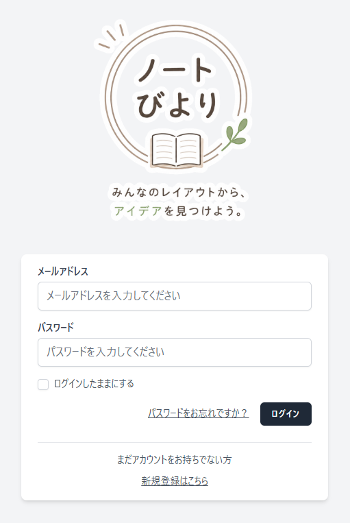

# ノートびより

ユーザーが愛用しているノートや手帳のオリジナルレイアウトを共有し、
新しいアイデアを見つけられる、レイアウト探しに特化したWebサービスです。

## 開発目的

AWSを活用したポートフォリオとして開発しています。

## 使用技術

### バックエンド
- PHP 8.5
- Laravel 12

### フロントエンド
- Vue 3
- TypeScript
- Inertia.js
- Vite

### データベース
- MySQL 8.4

### 開発環境
- Docker
- Laravel Sail

### インフラ
- AWS（予定）
- EC2
- RDS
- S3
- CloudFront

## 画面

### ログイン画面

## 最初に実装する機能

### 未ログイン

- トップページ（実質ログイン画面）
- アカウント新規登録画面
- 投稿詳細画面（リンクから直接アクセスした場合）

### ログイン後

- 新規投稿画面
- マイページ
  - アイコン画像の変更
  - ハンドルネームの変更
- 投稿一覧画面
  - 自分以外の投稿を表示
  - キーワード検索

## 今後追加予定の機能

- 自分の投稿一覧
- 自分の投稿内容の編集
- パスワードリセット
- パスワード変更
- 管理者画面

## 開発状況

🚧 開発中